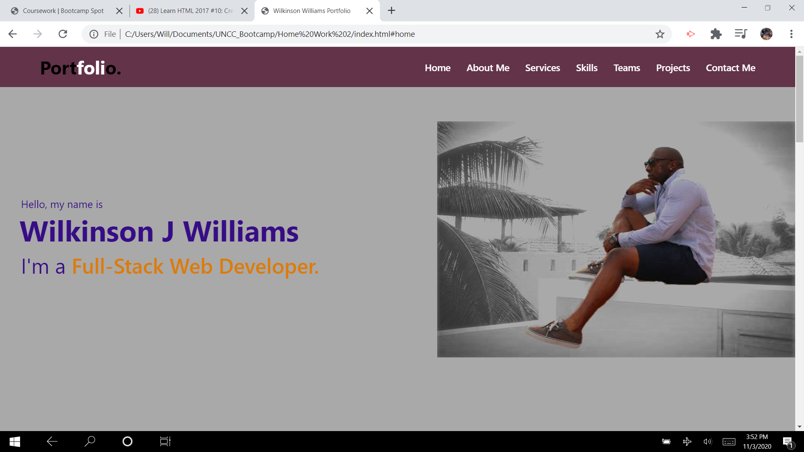

## My Portfolio 

## Discription
In a world of innovation, it is necessary to stand out among the compotition. What says professional, more than your own portfolio website.

In this assignment, I was requested to create a fully functional and responsive website. I used HTML and CSS to style this portfolio website.

## Motivation
My main focus is to have the best chances when I enter the industry of web development. In this space, it is very competative. The difference between a job and not, could all fall on the way you introduce yourself to the hiring managers at a company. What better way to introduce yourself, than a portfolio site. The employer gets a chance to see your work, you, and your skill set.

## Screen-shots of the Website

